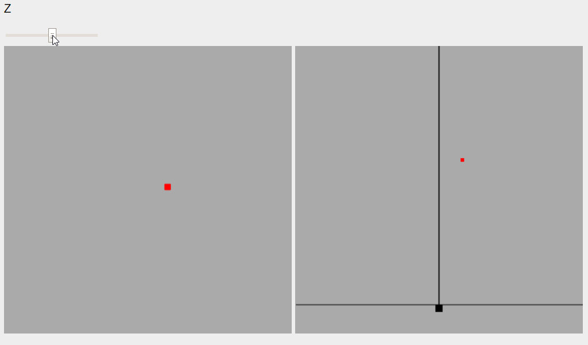
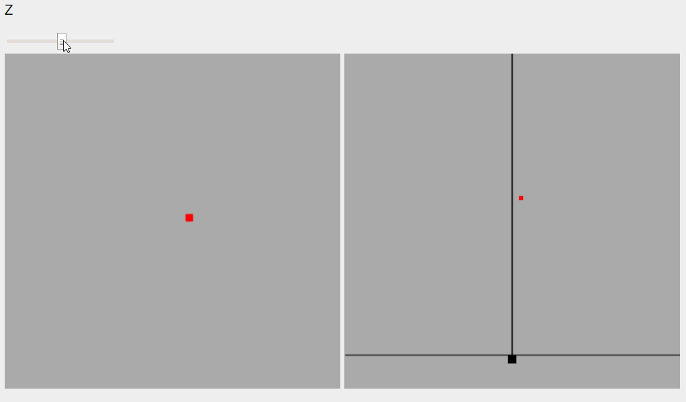
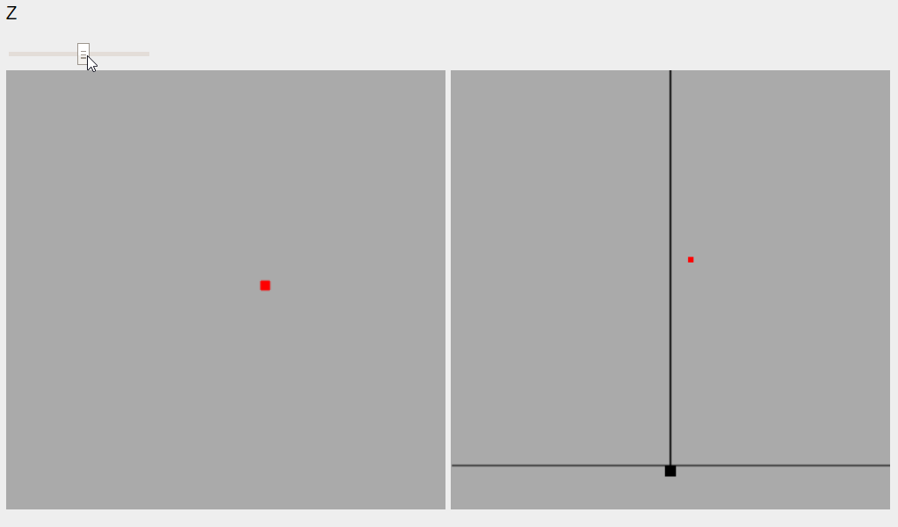
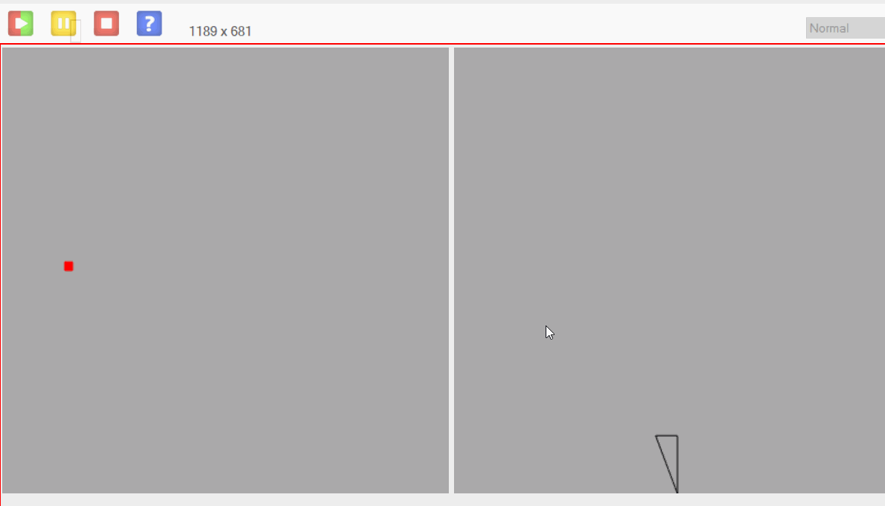
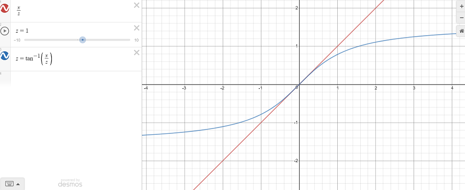

Have you ever asked yourself 'How do 3D coordinates get projected onto a 2D screen'? If so, this page might be for you.

**CURRENTLY UNDER CONSTRUCTION, CHECK BACK IN A COUPLE DAYS!**

In this page, I will go over the basic formula for projecting 3D coordinates onto a 2D 'camera' screen, and explain the logic that helped me figure these concepts out.

## TL;DR

First normalize your points with either of these formulas: (camera_x=x/z, camera_y=y/z) or (arctan(z/x), arctan(z/y)). Once you have these normalized x and y coordinates, 'stretch' them by the width and height of your screen. Voila, you're rendering 3D! To have camera rotation / movement, simply find the 'localized' coordinates you want to render before projecting them (localized meaning that the coordinates are the distance from the camera to the object, and they have been rotated by the rotation of the camera).

## Getting started

The first step to understanding the concepts here is to look at the desired behavior. Our situation is that we have a single 3D point, and we want to draw a point on our screen that mimics our view of the world. To make things simpler, we'll examine things one plane at a time, so first the x-z plane, and then the y-z plane. Let's assume x is some small positive number, and think about what should happen on screen as z changes. As z increases (the point gets farther away), the point should get ever-closer to 0. For a better idea of how this should look, view the diagram below.

Alright, so that's how it looks when z changes and x is constant. Similarly, we should look at *x* changing while *z* remains constant. We have a few options here. One option is a 'flat' perspective, where x almost exactly translates to the screen, seen below (yes I know it says z on the slider, it's meant to say x).

Our second option is a 'fish eye' perspective, where x is squished towards the edges, such that as x grows the camera_x grows at an increasingly slower rate. This is shown below.

I know this isn't super obvious in these gifs, but the effect is much clearer on scenes with more polygons and screen size (you'll have to test this one out for yourself). I will first describe how we will achieve the 'flat' perspective, and then afterwards show the 'fisheye' formula.

## Flat Perspective

Now that we know our expected behavior, we can attempt to find a formula for camera_x that incorporates x and z, and matches what we want to achieve. Firstly, the x component for this is easy, it is simply some constant *c* times x. The z component is more tricky, and there are multiple that seem to match, but the simplest is simply some constant *c* divided by x. This isn't exactly mathematical, but if we simply 'jam' these two pieces together, we find: **camera_x = c\*x/z**.

Alright, so now we have a formula, how do we test it? Well, you just plug it into a program and see what it does! No really, the best way to test this kind of thing is to see if it lines up with your expectations in practice.

So now we have an equation for our camera_x, how do we find camera_y? Simply put, it's the same thing. All of the logic that we used to find the formula for camera_x applies to camera_y, since depth is really what we are trying to encode here. So, **camera_y=c\*y/z**. 

## Fisheye perspective

We'll take an entirely different path to find these formulas: trigonometry. *Wait, no, stop running away! I promise it'll be cool!* So, let's take a step back from thinking of x and z separately, and think more about what behavior we want them to have together. We want some value that relates to both x and z in the ways described early. If we think of x and z as moving a point around on a graph, and our camera_x being the value our formula gives us. Now imagine drawing a line from your camera to that point. See below to help your imagination:

Notice that drawing the point on the x-z plane like this has almost given us a triangle? why don't we go ahead and finish that triangle, with the sides of length z and x, like so:

Now we can clearly see a shape that relates both x and z. How does this relate to rendering? I'm glad you asked. By taking the angle of the corner at the origin, we have a *single value that relates x and z*. The formulat for this angle is *arctan(x/z)*, so we can try plugging that into our program! It's a good idea to use atan2(x, z), since we're dealing with possibly-negative values. Once you plug this in to a testing program, you'll see that it does in fact mimic the behavior we're seeking, with full fisheye effect!

## Reconciling fisheye with flat

So why do both of these methods work? Because they approximate eachother, but with different behaviors. As seen in the graph below, especially at smaller values, these two separate formulas approximate each other very well. However, they begin to diverge as values increase. This gives the different effects on the edge of the screen, where the arctan does not increase nearly as fast with larger values as x/z does.

